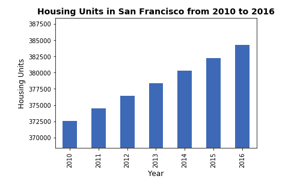

# Pythonic Monopoly using PyViz

*[San Francisco Park Reading by Juan Salamanca](https://www.pexels.com/photo/park-san-francisco-reading-61109/) | [Free License](https://www.pexels.com/photo-license/)*

## Background
This project is for a pseudo real estate team which wants to provide customers with a broader range of portfolio options for the San Francisco market. I have built a dashboard to display this. 

The goal of this dashboard is to provide charts, maps, and interactive visualizations that help customers explore the data and determine if they want to invest in rental properties in San Francisco.

---
### Rental Analysis

The first step to building the dashboard is to work out all of the calculations and visualizations in an analysis notebook. Once the code is worked out here, it can be copied over to a dashboard code and used with Panel to create the final layout.

#### Housing Units Per Year

Calculated the number of housing units per year and visualize the results as a bar chart using the Pandas plot function.

Default Bar Chart

  

Bar Chart with y-axis limits adjusted

  

#### Average Gross Rent in San Francisco Per Year

Visualized the average gross rent per year to better understand the trends for rental income over time. Visualized the average (mean) gross rent per year and visualized it as a line chart.

1. Calculated the mean `gross` for each year.
2. Visualized the mean gross rent per year as a line chart.

  

#### Average Sales Price Per Year

Determined the average sales price per year to better understand the sales price of the rental property over time. For example, a customer will want to know if they should expect an increase or decrease in the property value over time so they can determine how long to hold the rental property. Visualized the average (mean) `sales_price_sqr_foot` and visualized it as a bar chart.

1. Calculated the mean `gross` for each year.
2. Visualized the mean gross rent per year as a line chart.

  

#### Average Prices By Neighborhood

Compared the average prices by neighborhood.

1. Grouped the data by year and by neighborhood and calculated the average (mean) `sales_price_sqr_foot`.
2. Visualized the mean `sales_price_sqr_foot` per year with the neighborhood as a dropdown selector.

  

#### Top 10 Most Expensive Neighborhoods

Figured out which neighborhoods are the most expensive. To do this I calculated the mean sale price for each neighborhood and then sort the values to obtain the top 10 most expensive neighborhoods on average. Ploted the results as a bar chart.

  

#### Parallel Coordinates and Parallel Categories Analysis

Used plotly express to create parallel coordinates and parallel categories visualizations so that investors can interactively filter and explore various factors related to the sales price of the neighborhoods.

Using the DataFrame of Average values per neighborhood (calculated above), created the following visualizations:

1. Create a Parallel Coordinates Plot

  

2. Create a Parallel Categories Plot

  

#### Neighborhood Map

Read in neighborhood location data and built an interactive map with the average prices per neighborhood. Used a scatter mapbox object from plotly express to create the visualization. I used the mapbox API key for this.

  

### Dashboard

Used the Panel library to build an interactive dashboard for all of the visualizations.
Created a new `dashboard.ipynb` for the dashboard code.

Final Dashboard:

  
